# Отчёт о выполнении лабораторной работы №1 Установка и конфигурация операционной системы на виртуальную машину
***Российский Университет Дружбы Народов***  
***Факульткт Физико-Математических и Естественных Наук***  

 ***Дисциплина:*** *Операционные системы*  
 
 ***Работу выполнял:*** *Адебайо Ридван*
  *1032205020*  
 
 *НКНбд-01-20*  
 
 ***Москва. Дисплейный класс РУДН. 2021г.*** 
 
# Цель работы
Целью данной работы является приобретение практических навыков установки операционной системы на виртуальную машину, настройки минимально необходимых для
дальнейшей работы сервисов.

# Задание
Установить и настроить для дальнейшей работы виртуальную машину Linux

# Выполнение лабораторной работы
1.	Я установил на личный компьютер Oracle Virtual Machine  
	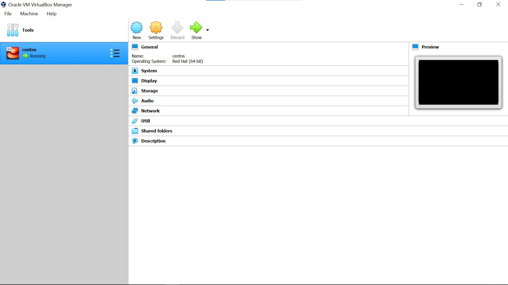
2. Настраиваю VM для установки Linux CentOS  
	- Указываю имя виртуальной машины и тип гостевой ОС  
	
	- Создаю виртуальный диск типа VDI объемом 30 Гб  
	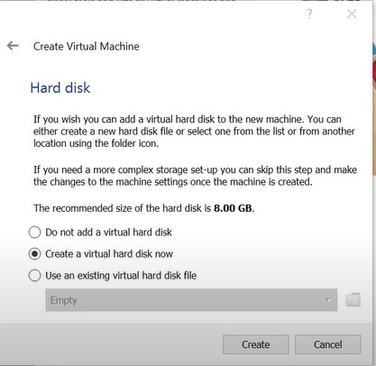
3. Пошаговая установка и настройка CentOS  
	- В разделе "Выбор приложений" выбираем "Сервер с GUI"  
	
	- Установка пароля администратора  
	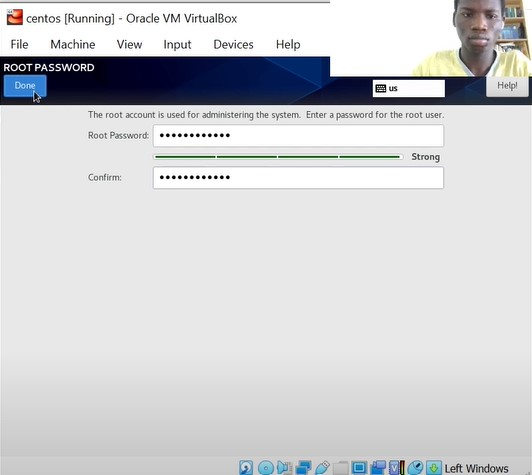
	- Отключаю KDUMP  
	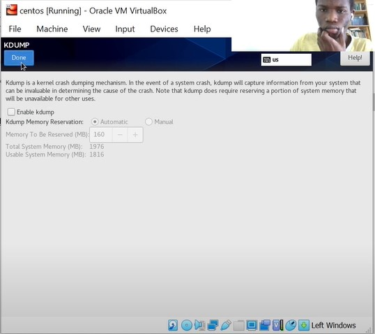
	- Принимаем лицензионное соглашение  
	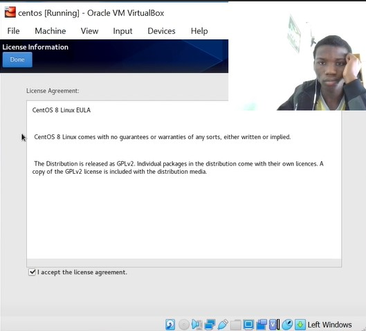
4. Подключаю образ диска дополнений гостевой ОС  
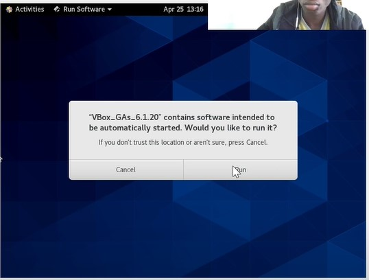

# Домашнее задание
1. Анализирую последовательность загрузки системы с помощью команды ```dmesg | less```  
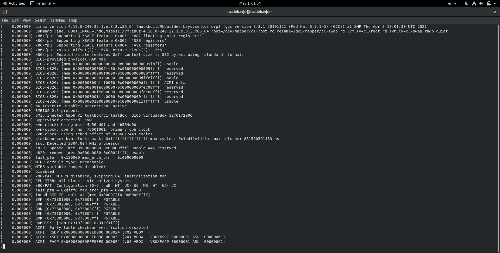
2. Получаем необходимую информацию с помощью команды ```dmesg | grep -i "..."```  
    1. Версия ядра линукс  
    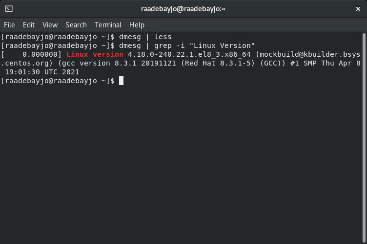
    2. Частота процессора  
    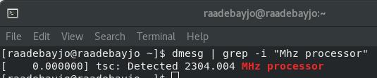
    3. Модель процессора  
    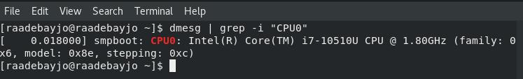
    4. Объем доступной оперативной памяти  
    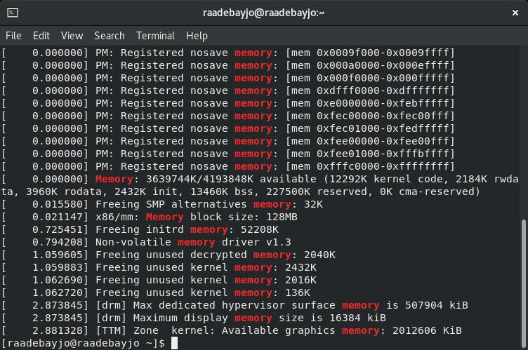
    5. Тип обнаруженного гипервизора  
    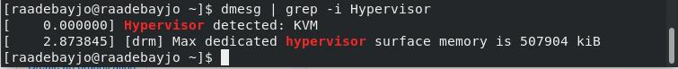
    6. Тип файловой системы корневого раздела  
    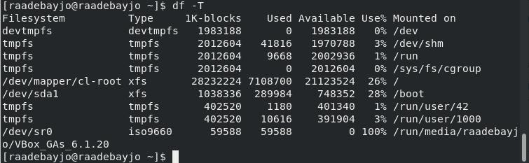
    7. Последовательность монтирования файловых систем  
    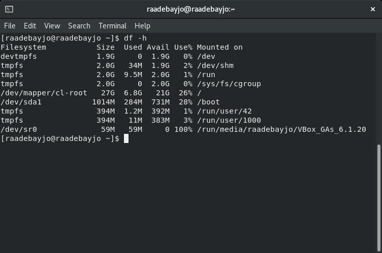
   
# Выводы
Данная лабораторная работа помогла мне научиться устанавливать и использовать виртуальную машину для работы.
Я научился производить первоначальную настройку Oracle VM для работы с ОС CentOS.
Также я научился использовать команду ```dmesg``` для поиска нужной информации о системе.

# Контрольные вопросы
1. Учетная запись пользователя содержит такие команды, как:
	- Системное имя пользователя
	- Пароль
	- Уникальный идентификатор пользователя (UID)
	- Идентификатор группы пользователя (GID)
	- Директория, в которой работает пользователь

2. Команды терминала:
	1. Для получения справки по команде используется флаг ```--help``` или ```-h```, 
	например ```cd --help```
	2. Для перемещения по файловой системе используется команда ```cd```,
	например 
	```cd downloads``` - перемещение в каталог "downloads" 
	```cd ..``` - перемещение в корневой каталог
	3. Для просмотра содержимого каталога используется команда ```ls```
	4. Для определения объема каталога используется команда ```du```
	Для удобства лучше использовать с ключами ```-s``` и ```-h```
	например ```du -hs /downloads```
	5. Чтобы создать файл или каталог, используются команды ```touch``` и ```mkdir``` соответственно
	например ```touch text.txt```, ```mkdir downloads2```
	Чтобы удалить файл или каталог, используются команды ```rm``` и ```rmdir``` соответственно
	например ```rm text.txt```, ```rmdir downloads2```
	6. Для создания и редактирования прав файла/каталога используют ```chmod```
	например ```chmod 777 text.txt```
	7. Для просмотра истории команд используют  ```history```
3. Файловая система - это порядок, определяющий организацию, структуру, хранение и именование на определенном логическом носителе
Примеры наиболее распространенных файловых систем: *NTFS*, *FAT32*, *exFAT*
4. Узнать, какие ФС смонтированы в ОС, можно узнать с помощью команды ```mount```
5. Можно использовать команду ```killall *Process Name*```
