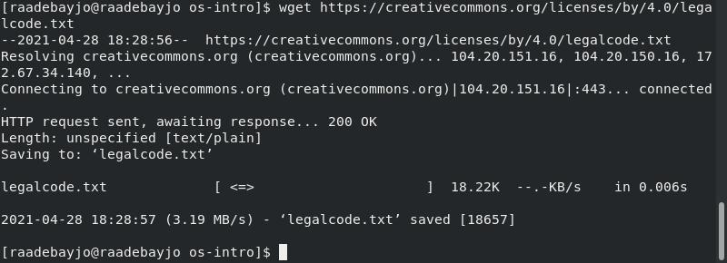
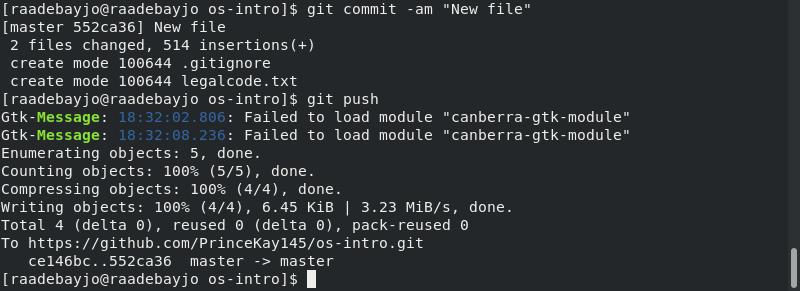
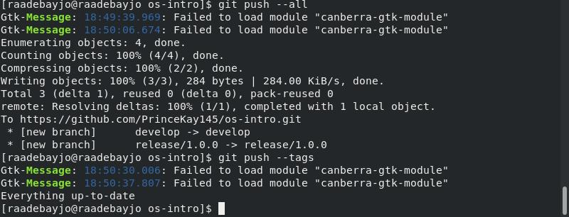

# Отчёт о выполнении лабораторной работы №2 Управление версиями
***Российский Университет Дружбы Народов***  
***Факульткт Физико-Математических и Естественных Наук***  

 ***Дисциплина:*** *Операционные системы* 
 ***Работу выполнял:*** *Адебайо Ридван*  
 
 *1032205020*  
 
 *НКНбд-01-20*  
 
 ***Москва. Дисплейный класс РУДН. 2021г.*** 
 
 ## Основная задача, которую мне нужно сделать

* научиться отправлять и извлекать запросы из GitHub,
* научиться работать с git-flow и сделать релиз, а затем отправить свой код в github.

---
## Задачи
Настроить git на своем компьютере, инициализировать локальный репозиторий в папке с лабораторными работами, добавить все нужные файлы в репозиторий, подключить удаленный репозиторий с github, связать локальный и удаленные репозитории

# Вывод
 В ходе своей работы я создал учетную запись github и репозиторий, подключил SSH-ключ и записал новые файлы на свой github из терминала
