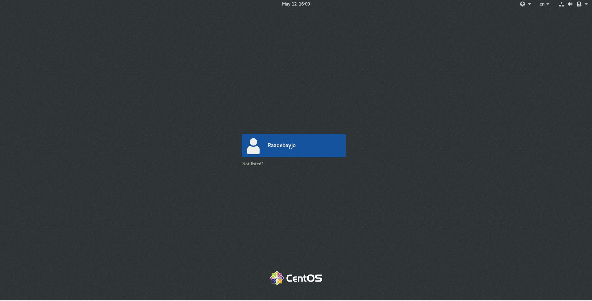
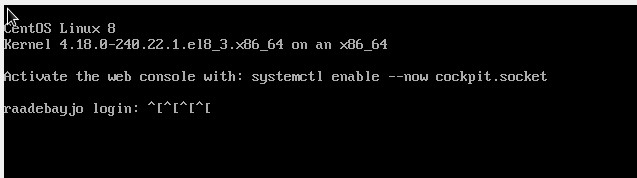
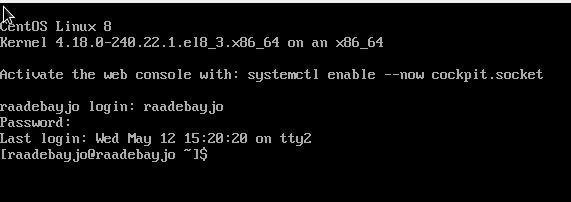
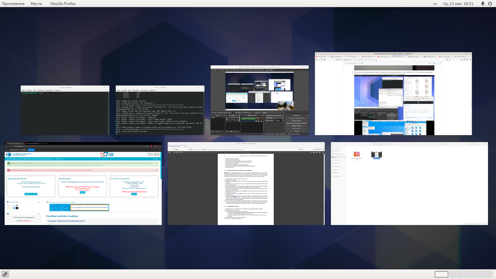

---
# Front matter
lang: ru-RU
title: "Шаблон отчёта по лабораторной работе 4"
subtitle: "Операционные Системы"
author: "Адебайо Ридануллахи Айофе"
std. number: "1032205020"
Group: "НКНбд-01-20"

# Formatting
toc-title: "Содержание"
toc: true # Table of contents
toc_depth: 2
lof: true # List of figures
lot: true # List of tables
fontsize: 12pt
linestretch: 1.5
papersize: a4paper
documentclass: scrreprt
polyglossia-lang: russian
polyglossia-otherlangs: english
mainfont: PT Serif
romanfont: PT Serif
sansfont: PT Sans
monofont: PT Mono
mainfontoptions: Ligatures=TeX
romanfontoptions: Ligatures=TeX
sansfontoptions: Ligatures=TeX,Scale=MatchLowercase
monofontoptions: Scale=MatchLowercase
indent: true
pdf-engine: lualatex
header-includes:
  - \linepenalty=10 # the penalty added to the badness of each line within a paragraph (no associated penalty node) Increasing the value makes tex try to have fewer lines in the paragraph.
  - \interlinepenalty=0 # value of the penalty (node) added after each line of a paragraph.
  - \hyphenpenalty=50 # the penalty for line breaking at an automatically inserted hyphen
  - \exhyphenpenalty=50 # the penalty for line breaking at an explicit hyphen
  - \binoppenalty=700 # the penalty for breaking a line at a binary operator
  - \relpenalty=500 # the penalty for breaking a line at a relation
  - \clubpenalty=150 # extra penalty for breaking after first line of a paragraph
  - \widowpenalty=150 # extra penalty for breaking before last line of a paragraph
  - \displaywidowpenalty=50 # extra penalty for breaking before last line before a display math
  - \brokenpenalty=100 # extra penalty for page breaking after a hyphenated line
  - \predisplaypenalty=10000 # penalty for breaking before a display
  - \postdisplaypenalty=0 # penalty for breaking after a display
  - \floatingpenalty = 20000 # penalty for splitting an insertion (can only be split footnote in standard LaTeX)
  - \raggedbottom # or \flushbottom
  - \usepackage{float} # keep figures where there are in the text
  - \floatplacement{figure}{H} # keep figures where there are in the text
---

# Цель работы

Познакомиться с операционной системой Linux, получить практические навыки работы с консолью и некоторыми графическими менеджерами рабочих столов операционной
системы.

# Задание

1. Ознакомиться с теоретическим материалом.
2. Загрузить компьютер.
3. Перейти на текстовую консоль. Сколько текстовых консолей доступно на вашем компьютере?
4. Перемещаться между текстовыми консолями. Какие комбинации клавиш необходимо
при этом нажимать?
5. Зарегистрироваться в текстовой консоли операционной системы. Какой логин вы при
этом использовали? Какие символы отображаются при вводе пароля?
6. Завершить консольный сеанс. Какую команду или комбинацию клавиш необходимо
для этого использовать?
7. Переключиться на графический интерфейс. Какую комбинацию клавиш для этого
необходимо нажать?
8. Ознакомиться с менеджером рабочих столов. Как называется менеджер, запускаемый
по умолчанию?
9. Поочерёдно зарегистрироваться в разных графических менеджерах рабочих столов
(GNOME, KDE, XFCE) и оконных менеджерах (Openbox). Продемонстрировать разницу
между ними, сделав снимки экрана (скриншоты). Какие графические менеджеры
установлены на вашем компьютере?
10. Изучить список установленных программ. Обратить внимание на предпочтительные программы для разных применений. Запустите поочерёдно браузер, текстовой
редактор, текстовой процессор, эмулятор консоли. Укажите названия программ.

# Выполнение лабораторной работы

1. Ознакомился с теоретическим материалом.
2. Загрузил компьютер (рис. 001)

3. Перешёл на текстовую консоль. Она выглядит как командная строка. На моем компьютере доступно 6 текстовых консолей.(рис. 002)

4. Переместился между текстовыми консолями, нажимая комбинацию клавиш *ALT+(F1-F6).
5. Зарегистрировалась в текстовой консоли операционной системы, используя свой логин и пароль.

6. Завершил консольный сеанс, используя команду logout или сочетание клавиш ctrl + Alt + Fn.

7. Переключился на графический интерфейс, используя комбинацию клавиш Ctrl + alt + F7.

8. Ознакомился с менеджером рабочих столов. Менеджер, запускаемый по умолчанию называется GNOME

9. Поочерёдно зарегистрировался в разных графических менеджерах рабочих столов (GNOME, KDE, XFCE) и оконных менеджерах (Openbox). На моем компьютере установлены следующие графические менеджеры...

- XFCE не подключено
- KDE не установлено

10. Изучил список установленных программ. Обратил внимание на предпочтительные программы для разных применений. Запустите поочерёдно браузер, текстовой редактор, текстовой процессор, эмулятор консоли.

# Контрольные вопросы
1. Компьютерный терминал - это интерфейс, позволяющий пользователю взаимодействовать с компьютером и его устройствами. 
Неоспоримым преимуществом является нетребовательность к железу, что позволяет раюотать даже на компьютерах с минимальной конфигурацией. Также исключаются баги и фризы GUI, что также ускоряет работу. 
2. Имя, под которым пользователь логинится в системе 
3. Пароли хранятся в скрытом файле /etc/shadow, который скрыт от обычных пользователей 
4. В домашнем каталоге пользователя 
5. root 
6. Да, имеет 
7. Иерархия пользователей, в зависимости от выданных прав. Для всех каталогов и файлов используются модификаторы доступа, которые позволяют регулировать действия других пользователей 
8. UID, GID, GECOS, домашнюю директорию, версию shell 
9. UID - уникальный идентификатор пользователя 
   GID - групповой идентификатор пользователя 
10. GECOS - номер поля учетной записи в файле /etc/passwd 
11. Домашний каталог - это каталог пользователя, в котором хранятся все его файлы и данные 
12. /home/vakarvetskiy 
13. Да, администратор может изменять содержимое домашнего каталога пользователя 
14. В этом файле хранятся данные об учетных записях пользователей 
15. Если в поле пароля стоит символ *, то пользователь не сможет войти в систему 
16. Виртуальные консоли - это представление многотерминальной раюоты в рамках одного устройства. В данном контексте вируальные - значит, что они все равно работают с этим устройством 
17. Для управления консолями, как физическими, так и виртуальными 
18. Это процесс обмена информацией пользователя и компьютера после авторизации пользователя и до завершения сеанса пользователем 
19. Готовый набор программ для определенных целей
20.  GTK, GTK+, GDK, Qt

# Выводы

Я познакомился с операционной системой Linux и выполнил несколько основных кодов. Я также знакомлюсь с графическим менеджером и типами, которые у нас есть. Мне удалось успешно провести лабораторную работу практически без проблем
