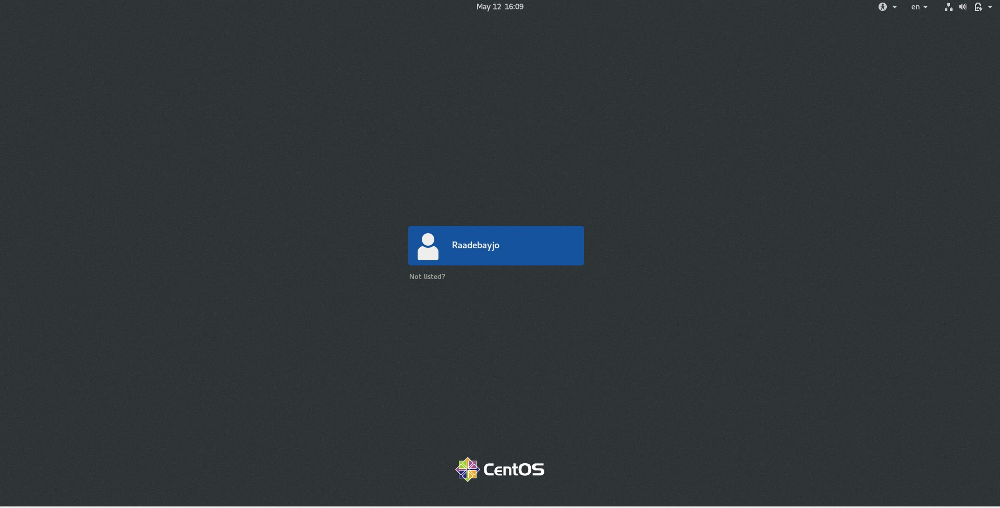
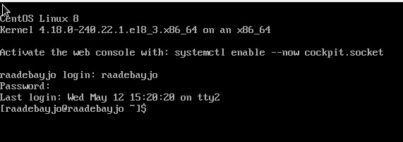
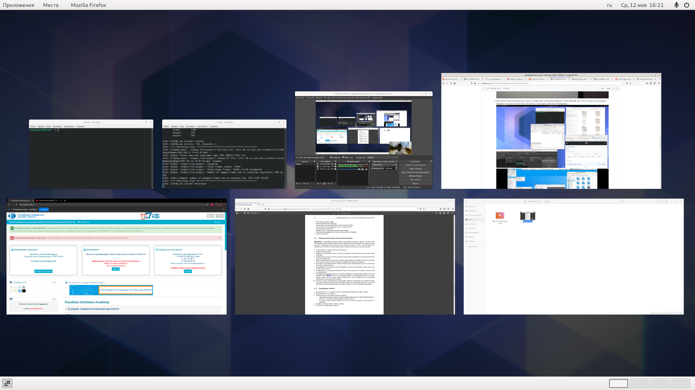

---
## Front matter
lang: ru-RU
title: Лабораторная Работа № 4
author: |Адебайо Ридвануллахи Айофе
institute: |Российский Университет Дрржбы Народов 
date: Москва, 2021

## Formatting
toc: false
slide_level: 2
theme: metropolis
header-includes: 
 - \metroset{progressbar=frametitle,sectionpage=progressbar,numbering=fraction}
 - '\makeatletter'
 - '\beamer@ignorenonframefalse'
 - '\makeatother'
aspectratio: 43
section-titles: true
---

# Операционные Системы

## Цель Работы

- Познакомиться с операционной системой Linux, получить практические навыки работы с консолью и некоторыми графическими менеджерами рабочих столов операционной
системы.

## Заданная Работа

- использовать виртуальные консоли
- изучить графические интерфейсы
- ознакомится с менеджером рабочих столов

## Выполнение Работы

- Загужил компьютер

- Перешел и работал на текстовую консоль

- Успешно переключил графический интерфейс

## Вывод
В результате выполнения лабораторной работы, я изучил основы работы с терминалом, менеджером столов и системы в целом

# Спасибо за внимание

