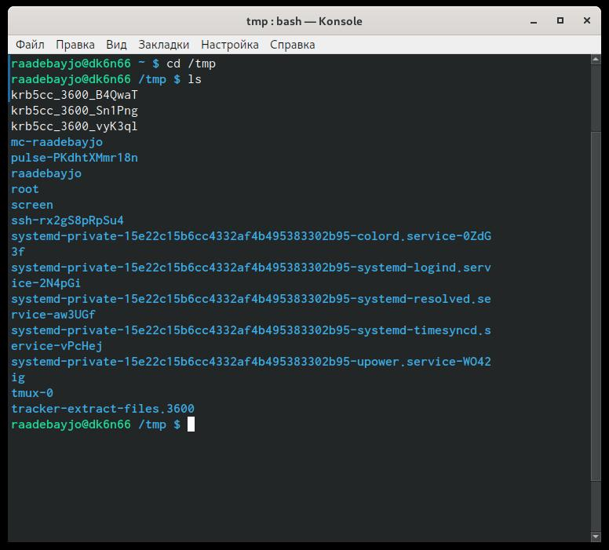

---
# Front matter
lang: ru-RU
title: "Шаблон отчёта по лабораторной работе № 5"
subtitle: "Операционные Системы"
author: "Адебайо Ридануллахи Айофе"
std. number: "1032205020"
Group: "НКНбд-01-20"

# Formatting
toc-title: "Содержание"
toc: true # Table of contents
toc_depth: 2
lof: true # List of figures
lot: true # List of tables
fontsize: 12pt
linestretch: 1.5
papersize: a4paper
documentclass: scrreprt
polyglossia-lang: russian
polyglossia-otherlangs: english
mainfont: PT Serif
romanfont: PT Serif
sansfont: PT Sans
monofont: PT Mono
mainfontoptions: Ligatures=TeX
romanfontoptions: Ligatures=TeX
sansfontoptions: Ligatures=TeX,Scale=MatchLowercase
monofontoptions: Scale=MatchLowercase
indent: true
pdf-engine: lualatex
header-includes:
  - \linepenalty=10 # the penalty added to the badness of each line within a paragraph (no associated penalty node) Increasing the value makes tex try to have fewer lines in the paragraph.
  - \interlinepenalty=0 # value of the penalty (node) added after each line of a paragraph.
  - \hyphenpenalty=50 # the penalty for line breaking at an automatically inserted hyphen
  - \exhyphenpenalty=50 # the penalty for line breaking at an explicit hyphen
  - \binoppenalty=700 # the penalty for breaking a line at a binary operator
  - \relpenalty=500 # the penalty for breaking a line at a relation
  - \clubpenalty=150 # extra penalty for breaking after first line of a paragraph
  - \widowpenalty=150 # extra penalty for breaking before last line of a paragraph
  - \displaywidowpenalty=50 # extra penalty for breaking before last line before a display math
  - \brokenpenalty=100 # extra penalty for page breaking after a hyphenated line
  - \predisplaypenalty=10000 # penalty for breaking before a display
  - \postdisplaypenalty=0 # penalty for breaking after a display
  - \floatingpenalty = 20000 # penalty for splitting an insertion (can only be split footnote in standard LaTeX)
  - \raggedbottom # or \flushbottom
  - \usepackage{float} # keep figures where there are in the text
  - \floatplacement{figure}{H} # keep figures where there are in the text
---

# Цель работы

Приобретение практических навыков взаимодействия пользователя с системой
посредством командной строки.

# Задание

1. Определите полное имя вашего домашнего каталога. Далее относительно этого каталога будут выполняться последующие упражнения.
2. Выполните следующие действия:
2.1. Перейдите в каталог /tmp .
2.2. Выведите на экран содержимое каталога /tmp . Для этого используйте команду ls с различными опциями. Поясните разницу в выводимой на экран
информации.
2.3. Определите, есть ли в каталоге /var/spool подкаталог с именем cron ?
2.4. Перейдите в Ваш домашний каталог и выведите на экран его содержимое.
Определите, кто является владельцем файлов и подкаталогов?
3. Выполните следующие действия:
3.1. В домашнем каталоге создайте новый каталог с именем newdir .
3.2. В каталоге ~/newdir создайте новый каталог с именем morefun .
3.3. В домашнем каталоге создайте одной командой три новых каталога с именами letters , memos , misk . Затем удалите эти каталоги одной командой.
3.4. Попробуйте удалить ранее созданный каталог ~/newdir командой rm . Проверьте, был ли каталог удалён.
3.5. Удалите каталог ~/newdir/morefun из домашнего каталога. Проверьте, был ли каталог удалён.
4. С помощью команды man определите, какую опцию команды ls нужно использовать для просмотра содержимое не только указанного каталога, но и подкаталогов, входящих в него.
5. С помощью команды man определите набор опций команды ls , позволяющий отсортировать по времени последнего изменения выводимый список содержимого каталога с развёрнутым описанием файлов.
6. Используйте команду man для просмотра описания следующих команд: cd , pwd , mkdir , rmdir , rm . Поясните основные опции этих команд.
7. Используя информацию, полученную при помощи команды history , выполните модификацию и исполнение нескольких команд из буфера команд.

# Выполнение лабораторной работы

1. Имя моего каталога с помощью команды *pwd*

2. Выполнил следующие действия:

2.1 Перешел в /tmp и вывел на экран содержимое каталога /tmp.
- с командой -ls

- с командой -ls -a

- с командой -ls -l

2.2 Да, в каталоге /var/spool есть подкаталог с именем cron.

2.3 Домашний каталог и его содержимое.

3. Выполнил следующие действия:

3.1 Создал новый каталог с именем newdir

3.2 Создал новый каталог с именем morefun в ~/newdir

3.3 Создал одной командой три новых каталога с именами letters , memos , misk и удалил эти каталоги

3.4 Нет, каталог не удалён.

3.5 Нет, каталог не удалён.

Проблема в том, что мы не можем удалить каталог только с комадой *rmdir*, но ещё добавить *-r*.

4. Команда ls для просмотра содержимое не только указанного каталога, но и подкаталогов, входящих в него, с помощью man.

5. Команда ls, позволяющий отсортировать по времени последнего изменения выводимый список содержимого каталога с развёрнутым описанием файлов с помощью man

6. Команда man для cd , pwd , mkdir , rmdir , rm.
- cd

- pwd

- mkdir

- rmdir

- rm

7. Команда history

# Выводы

В ходе выполнения лабораторных работ я научился использовать некоторые команды *ls*, *mkdir*, *cd*. С небольшим или без каких-либо трудностей я смог выполнить лабораторные упражнения
