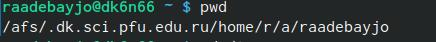
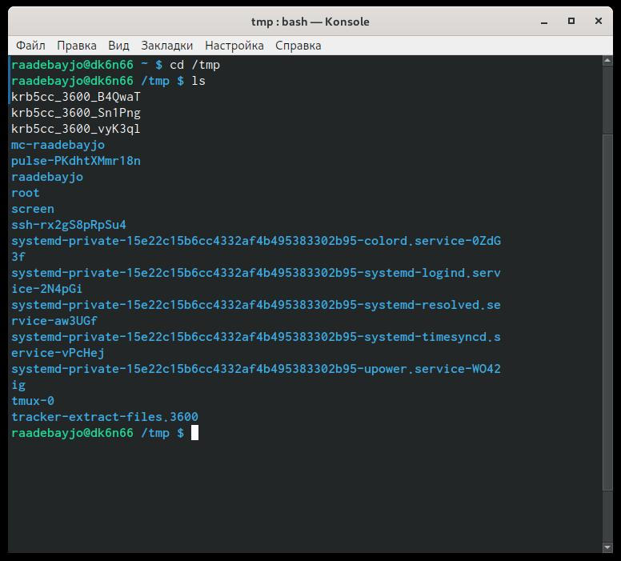
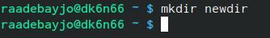
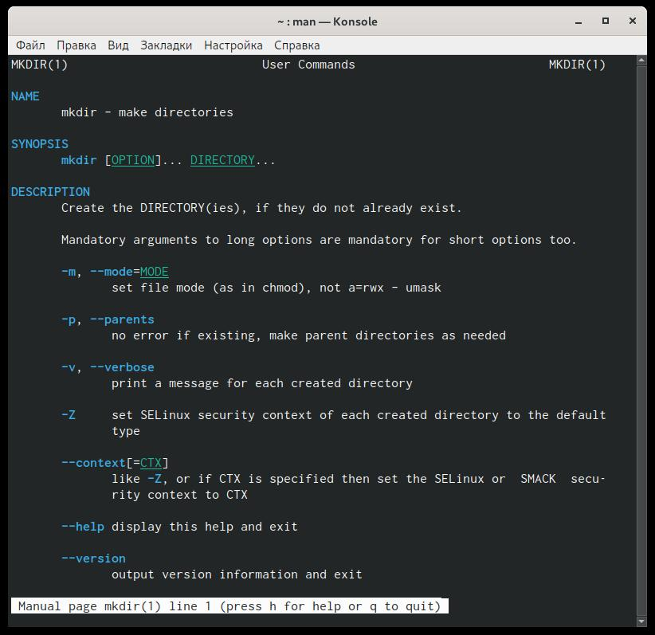
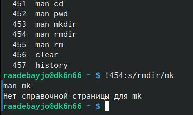

---
## Front matter
lang: ru-RU
title: Лаборатонная Работа № 5 
author: |
	Адебайо Ридвануллахи Айофе
institute: |
	Российский Университет Дужбы Народов
date: Москва, 2021

## Formatting
toc: false
slide_level: 2
theme: metropolis
header-includes: 
 - \metroset{progressbar=frametitle,sectionpage=progressbar,numbering=fraction}
 - '\makeatletter'
 - '\beamer@ignorenonframefalse'
 - '\makeatother'
aspectratio: 43
section-titles: true
---

# Операционные Системы

## Цель Работы

- Приобретение практических навыков взаимодействия пользователя с системой
посредством командной строки.

## Задача

- Свободно ориентироваться в файловой системе
- Беспрепятственно создавать и удалять файлы и каталоги
- Изучить опции известных функций

## Выполнение Работы

Теперь я могу создавать, удалять файлы и папки с помощью терминала.

## Вывод

В ходе выполнения лабораторных работ я научился использовать некоторые команды ``ls``, ``mkdir``, ``cd``, ``man``. С небольшим или без каких-либо трудностей я смог выполнить лабораторные упражнения

# Спасибо за внимание

