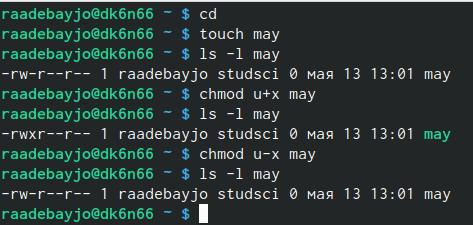
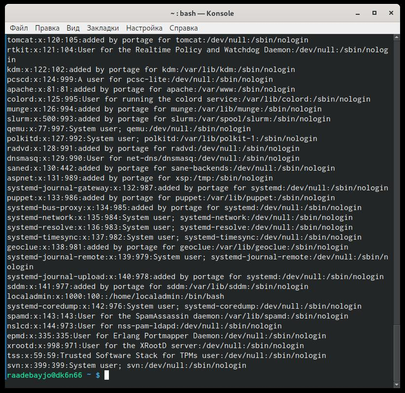
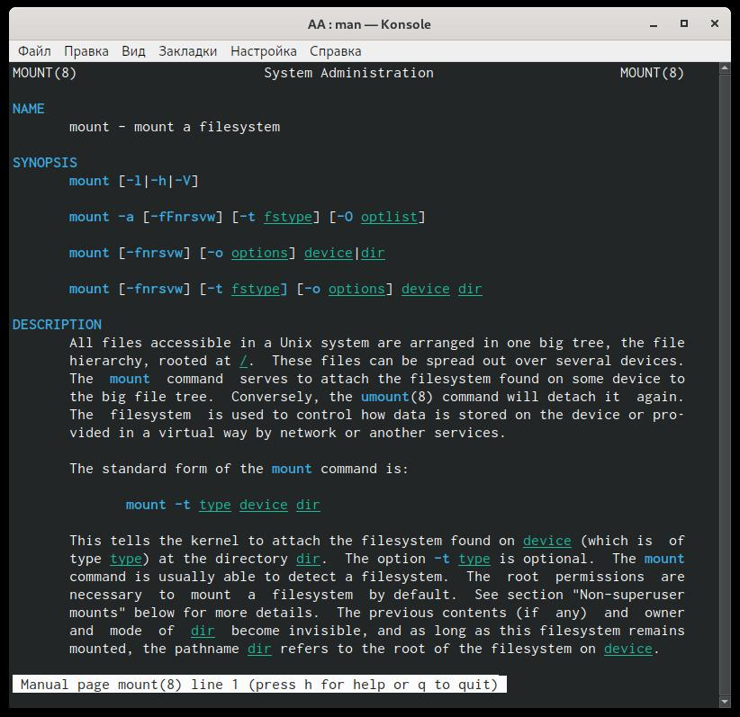
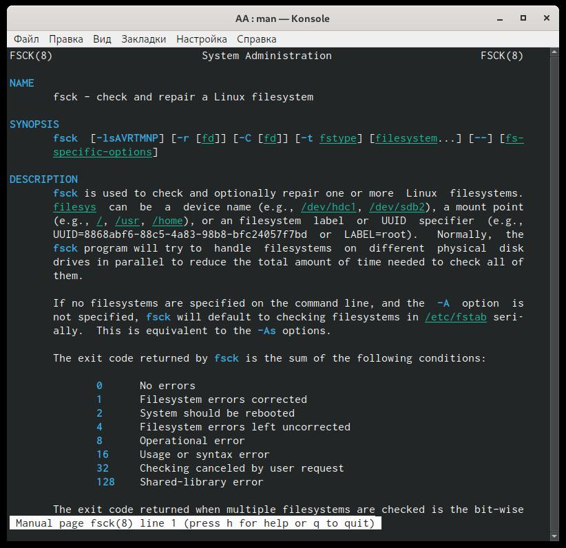
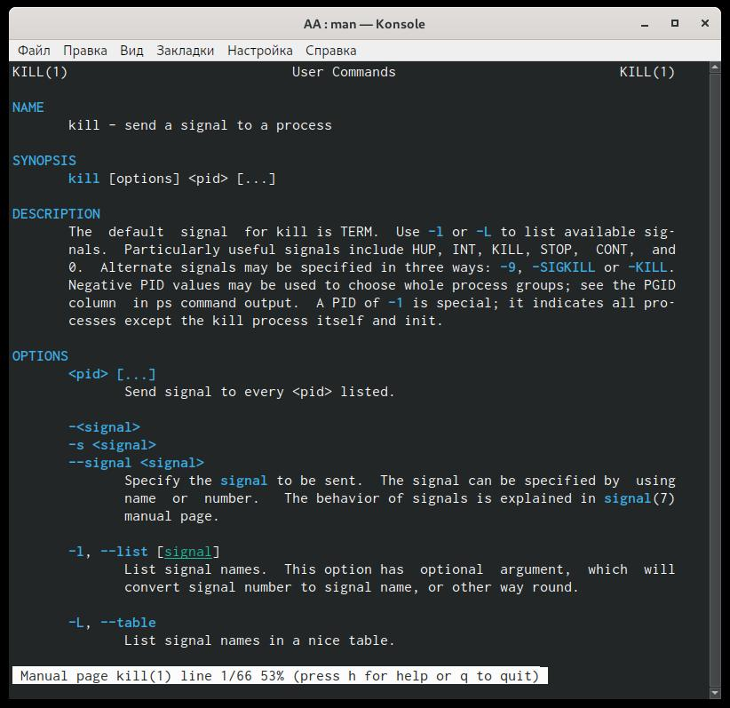

---
# Front matter
lang: ru-RU
title: "Шаблон отчёта по лабораторной работе № 6"
subtitle: "Операционные Системы"
author: "Адебайо Ридануллахи Айофе"
std. number: "1032205020"
Group: "НКНбд-01-20"

# Formatting
toc-title: "Содержание"
toc: true # Table of contents
toc_depth: 2
lof: true # List of figures
lot: true # List of tables
fontsize: 12pt
linestretch: 1.5
papersize: a4paper
documentclass: scrreprt
polyglossia-lang: russian
polyglossia-otherlangs: english
mainfont: PT Serif
romanfont: PT Serif
sansfont: PT Sans
monofont: PT Mono
mainfontoptions: Ligatures=TeX
romanfontoptions: Ligatures=TeX
sansfontoptions: Ligatures=TeX,Scale=MatchLowercase
monofontoptions: Scale=MatchLowercase
indent: true
pdf-engine: lualatex
header-includes:
  - \linepenalty=10 # the penalty added to the badness of each line within a paragraph (no associated penalty node) Increasing the value makes tex try to have fewer lines in the paragraph.
  - \interlinepenalty=0 # value of the penalty (node) added after each line of a paragraph.
  - \hyphenpenalty=50 # the penalty for line breaking at an automatically inserted hyphen
  - \exhyphenpenalty=50 # the penalty for line breaking at an explicit hyphen
  - \binoppenalty=700 # the penalty for breaking a line at a binary operator
  - \relpenalty=500 # the penalty for breaking a line at a relation
  - \clubpenalty=150 # extra penalty for breaking after first line of a paragraph
  - \widowpenalty=150 # extra penalty for breaking before last line of a paragraph
  - \displaywidowpenalty=50 # extra penalty for breaking before last line before a display math
  - \brokenpenalty=100 # extra penalty for page breaking after a hyphenated line
  - \predisplaypenalty=10000 # penalty for breaking before a display
  - \postdisplaypenalty=0 # penalty for breaking after a display
  - \floatingpenalty = 20000 # penalty for splitting an insertion (can only be split footnote in standard LaTeX)
  - \raggedbottom # or \flushbottom
  - \usepackage{float} # keep figures where there are in the text
  - \floatplacement{figure}{H} # keep figures where there are in the text
---

# Цель работы

Ознакомление с файловой системой Linux, её структурой, именами и содержанием каталогов. Приобретение практических навыков по применению команд для работы с файлами и каталогами, по управлению процессами (и работами), по проверке использования диска и обслуживанию файловой системы.

# Задание

1. Выполните все примеры, приведённые в первой части описания лабораторнойработы.
2. Выполните следующие действия, зафиксировав в отчёте по лабораторной работе используемые при этом команды и результаты их выполнения:
- Скопируйте файл /usr/include/sys/io.h в домашний каталог и назовите его equipment. Если файла io.h нет, то используйте любой другой файл в каталоге /usr/include/sys/ вместо него.
- В домашнем каталоге создайте директорию ~/ski.plases.
- Переместите файл equipment в каталог ~/ski.plases.
- Переименуйте файл ~/ski.plases/equipment в ~/ski.plases/equiplist.
- Создайте в домашнем каталоге файл abc1 и скопируйте его в каталог ~/ski.plases, назовите его equiplist2.
- Создайте каталог с именем equipment в каталоге ~/ski.plases.
- Переместите файлы ~/ski.plases/equiplist и equiplist2 в каталог ~/ski.plases/equipment.
- Создайте и переместите каталог ~/newdir в каталог ~/ski.plases и назовите его plans.
3. Определите опции команды chmod, необходимые для того, чтобы присвоить перечисленным ниже файлам выделенные права доступа, считая, что в начале таких прав нет:
- drwxr--r-- ... australia
- drwx--x--x ... play
- -r-xr--r-- ... my_os
- -rw-rw-r-- ... feathers
При необходимости создайте нужные файлы.
4. Проделайте приведённые ниже упражнения, записывая в отчёт по лабораторной работе используемые при этом команды:
-  Просмотрите содержимое файла /etc/password. 
-  Скопируйте файл ~/feathers в файл ~/file.old.
- Переместите файл ~/file.old в каталог ~/play.
- Скопируйте каталог ~/play в каталог ~/fun.
- Переместите каталог ~/fun в каталог ~/play и назовите его games.
- Лишите владельца файла ~/feathers права на чтение.
- Что произойдёт, если вы попытаетесь просмотреть файл ~/feathers командой cat?
- Что произойдёт, если вы попытаетесь скопировать файл ~/feathers?
- Дайте владельцу файла ~/feathers право на чтение.
- Лишите владельца каталога ~/play права на выполнение.
- Перейдите в каталог ~/play. Что произошло?
- Дайте владельцу каталога ~/play право на выполнение.
5. Прочитайте man по командам mount, fsck, mkfs, kill и кратко их охарактеризуйте, приведя примеры.

# Выполнение лабораторной работы

1. Выполнил все примеры, приведённые в первой части описания лабораторнойработы
- 1

- 2

- 3

2. Выполнил следующие действия:
- Скопируйте файл /usr/include/sys/io.h в домашний каталог и назовите его eqiuipment

- Создал файл ski.plases и переместил файл eqiuipment в каталог ~/ski.plases.

- Переименул файл ~/ski.plases/eqiuipment в ~/ski.plases/equiplist.

- Создал в домашнем каталоге файл abc1 и скопировал его в каталог ~/ski.plases, назвал его equiplist2

- Создал каталог с именем equipment в каталоге ~/ski.plases.

- Переместите файлы ~/ski.plases/equiplist и equiplist2 в каталог ~/ski.plases/equipment.

 

- Создал и переместите каталог ~/newdir в каталог ~/ski.plases и назвал его plans

3. Определил опции команды chmod

4. Проделал приведённые ниже упражнения
- Просмотрил содержимое файла /etc/password.

-  Скопируйте файл ~/feathers в файл ~/file.old.
- Переместите файл ~/file.old в каталог ~/play.
- Скопируйте каталог ~/play в каталог ~/fun.
- Переместите каталог ~/fun в каталог ~/play и назовите его games

- Лишите владельца файла ~/feathers права на чтение.

- попытался просмотреть файл ~/feathers командой cat, он не работает "доступа нет"

- попытался скопировать файл ~/feathers, он не работает "доступа нет"

- Дал владельцу файла ~/feathers право на чтение.

- Лишите владельца каталога ~/play права на выполнение.

- Перейдите в каталог ~/play. Он успешно работал.

- Дайте владельцу каталога ~/play право на выполнение.

5. Прочитайте man по командам mount, fsck, mkfs, kill.

- mount используется для подключения (монтирования) файловых систем и переносных накопителей

- fsck - проверяет файловую систему и исправляет в одной или нескольких файловых системах Linux

- mkfs - позволяет создать файловую систему Linux

- kill - убивает процесс

# Выводы

Ознакомился с файловой системой Linux, её структурой, именами и содержанием каталогов. Приобрел практические навыки по применению команд дляработы с файлами и каталогами, по управлению процессами (и работами), по проверке использования диска и обслуживанию файловой системы.
