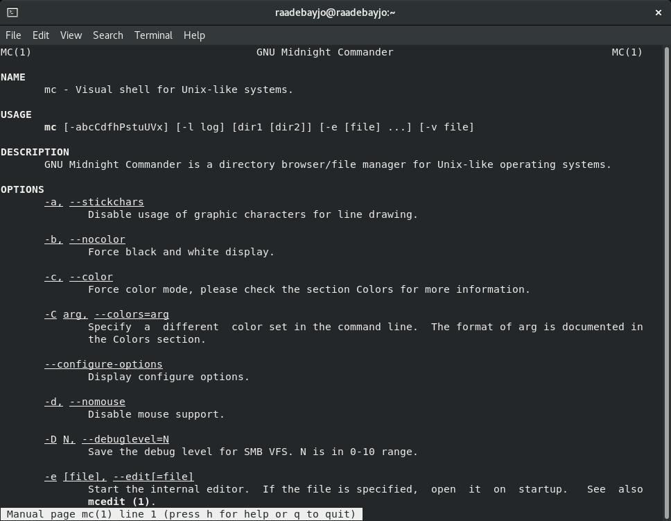
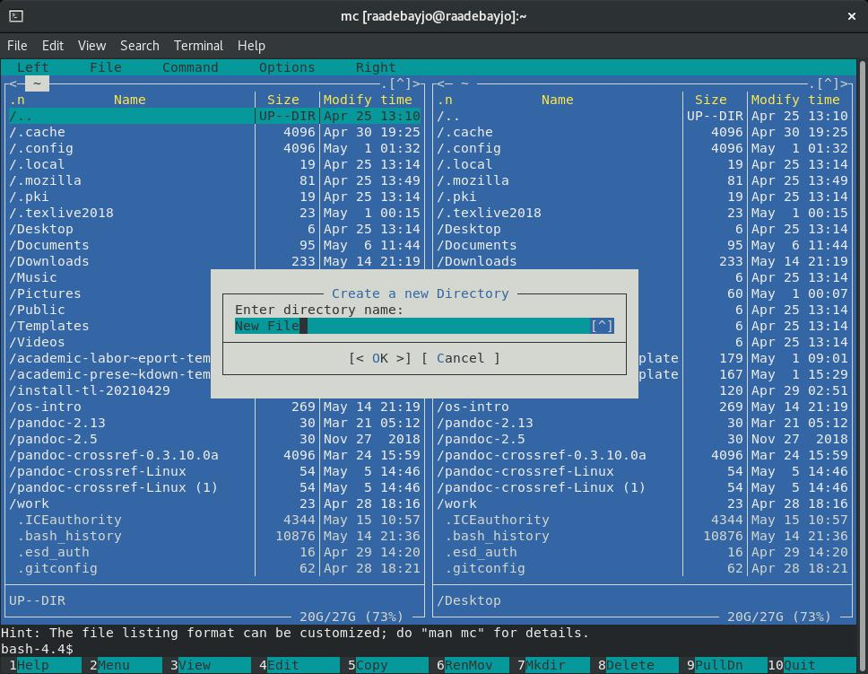

---
## Front matter
lang: ru-RU
title: Лаборатонная Работа № 8 
author: |
	Адебайо Ридвануллахи Айофе
institute: |
	Российский Университет Дужбы Народов
date: Москва, 2021

## Formatting
toc: false
slide_level: 2
theme: metropolis
header-includes: 
 - \metroset{progressbar=frametitle,sectionpage=progressbar,numbering=fraction}
 - '\makeatletter'
 - '\beamer@ignorenonframefalse'
 - '\makeatother'
aspectratio: 43
section-titles: true
---

# Операционные Системы

## Цель Работы

Освоение основных возможностей командной оболочки Midnight Commander.
Приобретение навыков практической работы по просмотру каталогов и файлов; манипуляций с ними.

## Задача

- работать с файлами через интерфейс Midnight Commander
- работать с файлами через текстовый редактор Midnight Commander

## Выполнение Работы
 
Теперь я могу работать с полуночным командиром. Я использовал его для копирования файлов, проверки места для хранения, перемещения файлов. А также я использовал midnight commander для работы с текстовыми файлами.

## Вывод

- Освоил основных возможностей командной оболочки Midnight Commander.
- Приобрел навыков практической работы по просмотру каталогов и файлов; манипуляций с ними.

## Спасибо за внимание

