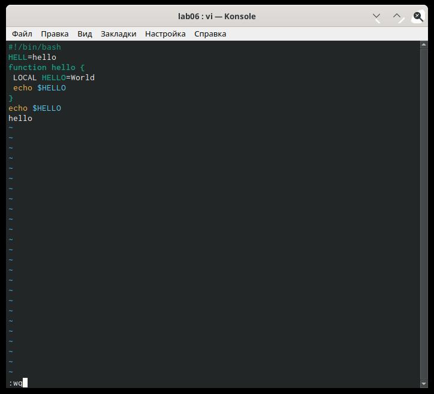
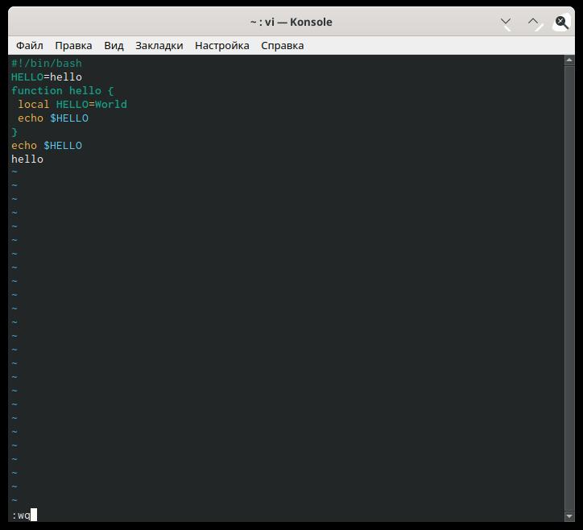

---
# Front matter
lang: ru-RU
title: "Шаблон отчёта по лабораторной работе № 9"
subtitle: "Операционные Системы"
author: "Адебайо Ридануллахи Айофе"
std. number: "1032205020"
Group: "НКНбд-01-20"

# Formatting
toc-title: "Содержание"
toc: true # Table of contents
toc_depth: 2
lof: true # List of figures
lot: true # List of tables
fontsize: 12pt
linestretch: 1.5
papersize: a4paper
documentclass: scrreprt
polyglossia-lang: russian
polyglossia-otherlangs: english
mainfont: PT Serif
romanfont: PT Serif
sansfont: PT Sans
monofont: PT Mono
mainfontoptions: Ligatures=TeX
romanfontoptions: Ligatures=TeX
sansfontoptions: Ligatures=TeX,Scale=MatchLowercase
monofontoptions: Scale=MatchLowercase
indent: true
pdf-engine: lualatex
header-includes:
  - \linepenalty=10 # the penalty added to the badness of each line within a paragraph (no associated penalty node) Increasing the value makes tex try to have fewer lines in the paragraph.
  - \interlinepenalty=0 # value of the penalty (node) added after each line of a paragraph.
  - \hyphenpenalty=50 # the penalty for line breaking at an automatically inserted hyphen
  - \exhyphenpenalty=50 # the penalty for line breaking at an explicit hyphen
  - \binoppenalty=700 # the penalty for breaking a line at a binary operator
  - \relpenalty=500 # the penalty for breaking a line at a relation
  - \clubpenalty=150 # extra penalty for breaking after first line of a paragraph
  - \widowpenalty=150 # extra penalty for breaking before last line of a paragraph
  - \displaywidowpenalty=50 # extra penalty for breaking before last line before a display math
  - \brokenpenalty=100 # extra penalty for page breaking after a hyphenated line
  - \predisplaypenalty=10000 # penalty for breaking before a display
  - \postdisplaypenalty=0 # penalty for breaking after a display
  - \floatingpenalty = 20000 # penalty for splitting an insertion (can only be split footnote in standard LaTeX)
  - \raggedbottom # or \flushbottom
  - \usepackage{float} # keep figures where there are in the text
  - \floatplacement{figure}{H} # keep figures where there are in the text
---

# Цель работы

Познакомиться с операционной системой Linux. Получить практические навыки работы с редактором vi, установленным по умолчанию практически во всех дистрибутивах.

# Задание 1. Создание нового файла с использованием vi

1. Создайте каталог с именем ~/work/os/lab06.
2. Перейдите во вновь созданный каталог.
3. Вызовите vi и создайте файл hello.sh
	vi hello.sh
4. Нажмите клавишу ``i`` и вводите следующий текст.
	#!/bin/bash
	HELL=Hello
	function hello {
		LOCAL HELLO=World
		echo $HELLO
	}
	echo $HELLO
	hello
5. Нажмите клавишу ``Esc`` для перехода в командный режим после завершения ввода текста.
6. Нажмите ``:`` для перехода в режим последней строки и внизу вашего экранапоявится приглашение в виде двоеточия.
7. Нажмите ``w`` (записать) и ``q`` (выйти), а затем нажмите клавишу ``Enter`` для сохранения вашего текста и завершения работы.
8. Сделайте файл исполняемым
	chmod +x hello.sh

# Задание 2. Редактирование существующего файла
1. Вызовите vi на редактирование файла
	vi ~/work/os/lab06/hello.sh
2. Установите курсор в конец слова HELL второй строки.
3. Перейдите в режим вставки и замените на HELLO. Нажмите ``Esc`` для возврата в командный режим.
4. Установите курсор на четвертую строку и сотрите слово LOCAL.
5. Перейдите в режим вставки и наберите следующий текст: local, нажмите ``Esc`` для возврата в командный режим.
6. Установите курсор на последней строке файла. Вставьте после неё строку, содержащую следующий текст: echo $HELLO.
7. Нажмите ``Esc`` для перехода в командный режим.
8. Удалите последнюю строку.
9. Введите команду отмены изменений ``u`` для отмены последней команды.
10. Введите символ ``:`` для перехода в режим последней строки. Запишите произведённые изменения и выйдите из vi.

# Выполнение лабораторной работы

# Задание 1. Создание нового файла с использованием vi
1. Создал каталог с именем ~/work/os/lab06.

2. Перешел во вновь созданный каталог.
3. Вызвал vi и создал файл hello.sh
	vi hello.sh

4. Нажимал клавишу ``i`` и ввел следующий текст.
	#!/bin/bash
	HELL=Hello
	function hello {
		LOCAL HELLO=World
		echo $HELLO
	}
	echo $HELLO
	hello
5. Нажимал клавишу ``Esc`` для перехода в командный режим после завершения ввода текста.
6. Нажимал ``:`` для перехода в режим последней строки и внизу вашего экранапоявится приглашение в виде двоеточия.
7. Нажимал ``w`` (записать) и ``q`` (выйти), а затем Нажимал клавишу ``Enter`` для сохранения вашего текста и завершения работы.

8. Сделайте файл исполняемым
	chmod +x hello.sh
	

# Задание 2. Редактирование существующего файла
1. Вызвал vi на редактирование файла
	vi ~/work/os/lab06/hello.sh
2. Установил курсор в конец слова HELL второй строки.
3. Перешел в режим вставки и замените на HELLO. Нажимал ``Esc`` для возврата в командный режим.
4. Установил курсор на четвертую строку и стер слово LOCAL.
5. Перешел в режим вставки и набрал следующий текст: local, Нажимал ``Esc`` для возврата в командный режим.
6. Установил курсор на последней строке файла. Вставил после неё строку, содержащую следующий текст: echo $HELLO.
7. Нажимал ``Esc`` для перехода в командный режим.
8. Удалил последнюю строку.
9. Введите команду отмены изменений ``u`` для отмены последней команды.
10. Введите символ ``:`` для перехода в режим последней строки. Запишите произведённые изменения и выйдите из vi. 

# Контрольные вопросы
1. Редактор vi имеет три режима работы:
- командный режим — предназначен для ввода команд редактирования и навигации по редактируемому файлу;
- режим вставки — предназначен для ввода содержания редактируемого файла;
-  режим последней (или командной) строки — используется для записи изменений в файл и выхода из редактора.
2. Можно нажимать символ q (или q!), если требуется выйти из редактора без сохранения.
3. Команды позиционирования:
- 0 (ноль) — переход в начало строки;
- $ — переход в конец строки;
- G — переход в конец файла;
- n G — переход на строку с номером n
4. Редактор vi предполагает, что слово - это строка символов, которая может включать в себя буквы, цифры и символы подчеркивания. 
5. G — переход в конец файла
6. Команды редактирования:
- Вставка текста
– ``а`` — вставить текст после курсора;
– ``А`` — вставить текст в конец строки;
– ``i`` — вставить текст перед курсором;
– n ``i`` — вставить текст n раз;
– ``I`` — вставить текст в начало строки.
- Вставка строки
– ``о`` — вставить строку под курсором;
– ``О`` — вставить строку над курсором.
- Удаление текста
– ``x`` — удалить один символ в буфер;
– ``d`` ``w`` — удалить одно слово в буфер;
– ``d`` ``$`` — удалить в буфер текст от курсора до конца строки;
– ``d`` ``0`` — удалить в буфер текст от начала строки до позиции курсора;
– ``d`` ``d`` — удалить в буфер одну строку;
– n ``d`` ``d`` — удалить в буфер n строк.
- Отмена и повтор произведённых изменений
– ``u`` — отменить последнее изменение;
– ``.`` — повторить последнее изменение.
- Копирование текста в буфер
– ``Y`` — скопировать строку в буфер;
– n ``Y`` — скопировать n строк в буфер;
– ``y`` ``w`` — скопировать слово в буфер.
- Вставка текста из буфера
– ``p`` — вставить текст из буфера после курсора;
– ``P`` — вставить текст из буфера перед курсором.
- Замена текста
– ``c`` ``w`` — заменить слово;
– n ``c`` ``w`` — заменить n слов;
– ``c`` ``$`` — заменить текст от курсора до конца строки;
– ``r`` — заменить слово;
– ``R`` — заменить текст.
- Поиск текста
– ``/`` текст — произвести поиск вперёд по тексту указанной строки символов текст;
– ``?`` текст — произвести поиск назад по тексту указанной строки символов текст.
7. ``$`` — переход в конец строки
8.  ``u`` — отменить последнее изменение
9. Режим последней  строки — используется для записи изменений в файл и выхода из редактора.
10. ``$`` — переход в конец строки
11. Опции редактора vi позволяют настроить рабочую среду. Для задания опций используется команда set (в режиме последней строки):
– : set all — вывести полный список опций;
– : set nu — вывести номера строк;
– : set list — вывести невидимые символы;
– : set ic — не учитывать при поиске, является ли символ прописным или строчным.
12. В редакторе vi есть два основных режима: командный режим и режим вставки. По умолчанию работа начинается в командном режиме. В режиме вставки клавиатура используется для набора текста. Для выхода в командный режим используется клавиша Esc или комбинация Ctrl + c .
13. 
# Выводы

Познакомился с операционной системой Linux.А также, я получил практические навыки работы с редактором vi, установленным по умолчанию практически во всех дистрибутивах.
