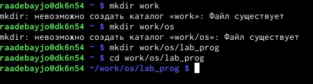
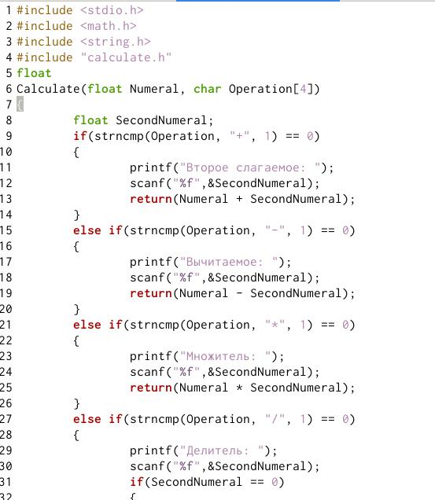
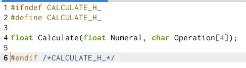
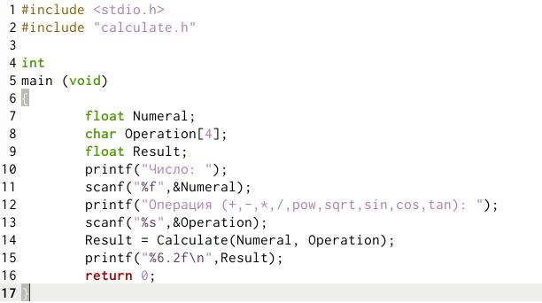
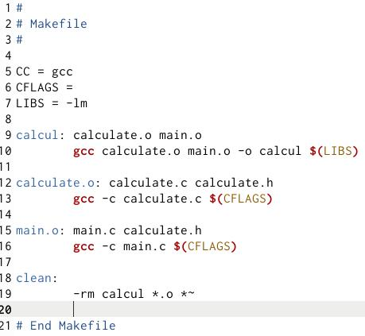
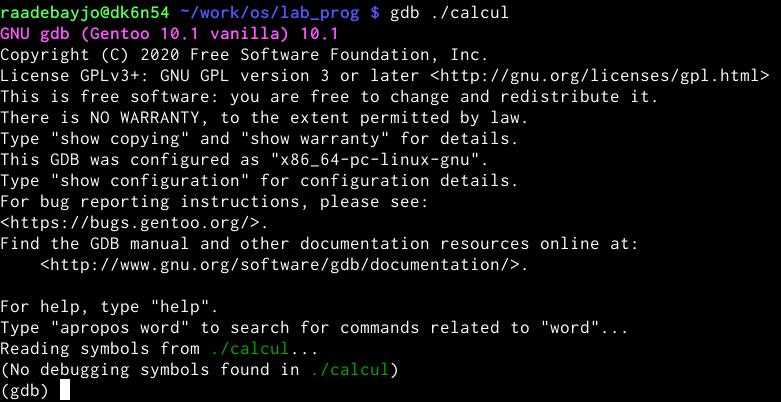
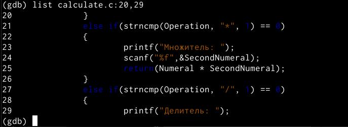
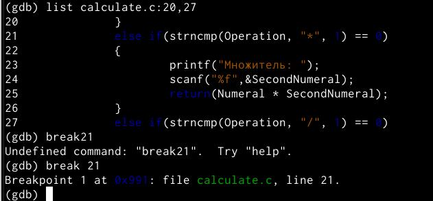

---
## Front matter
lang: ru-RU
title: Лаборатонная Работа № 14 
author: |
	Адебайо Ридвануллахи Айофе
institute: |
	Российский Университет Дужбы Народов
date: Москва, 2021

## Formatting
toc: false
slide_level: 2
theme: metropolis
header-includes: 
 - \metroset{progressbar=frametitle,sectionpage=progressbar,numbering=fraction}
 - '\makeatletter'
 - '\beamer@ignorenonframefalse'
 - '\makeatother'
aspectratio: 43
section-titles: true
---

# Операционные Системы

## Цель Работы

Приобрести простейшие навыки разработки, анализа, тестирования и отладки приложений в ОС типа UNIX/Linux на примере создания на языке программирования С калькулятора с простейшими функциями.

## Задача

1. Составьте каталог
2. Создание и заполнение файлов .c
3. Создайте файл Makefile
4. Используйте GDB для отладки и запуска файла .c
5. Используйте команду splint

## Выполнение Работы

- Составьте каталог

- Создание и заполнение файлов .c

## Выполнение Работы

## Выполнение Работы

- Создайте файл Makefile

## Выполнение Работы

- Используйте GDB для отладки и запуска файла .c

## Выполнение Работы

## Выполнение Работы

- Используйте команду splint

## Вывод

В результате работы , я приобрёл простейшие навыки разработки, анализа, тестирования и отладки приложений в Линукс

# Спасибо за внимание

